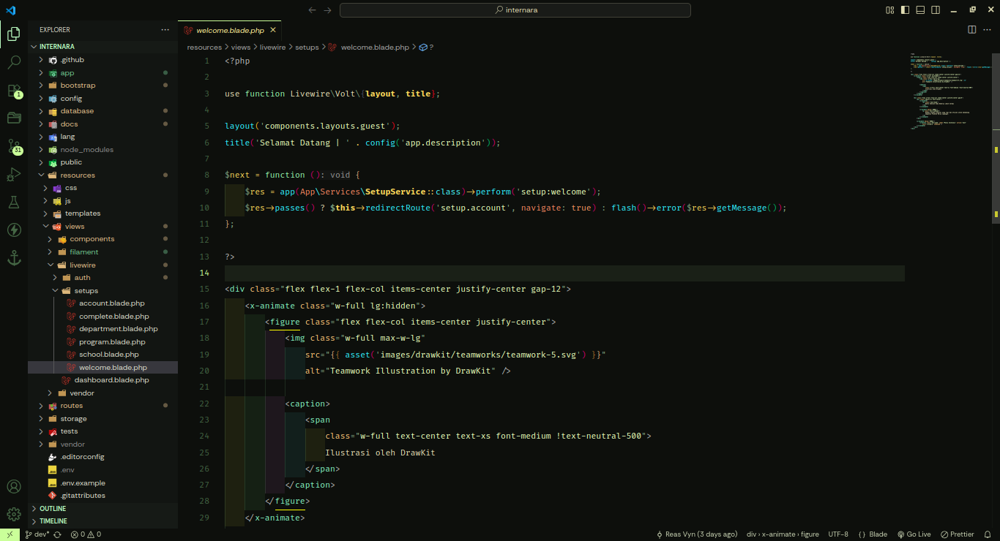
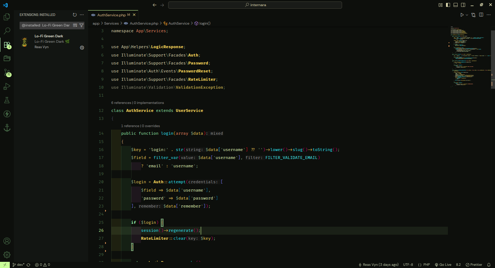
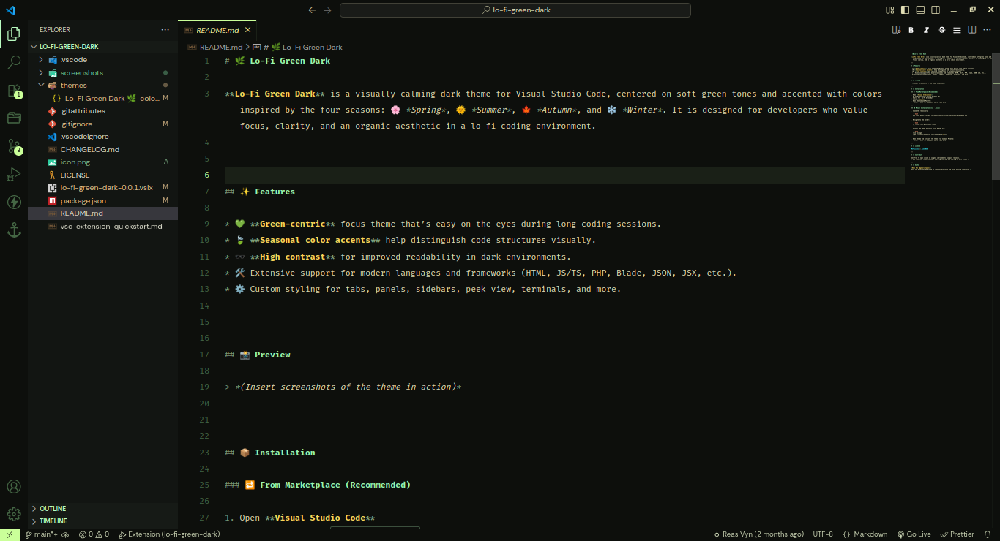

# 🌿 Lo-Fi Green Dark

**Lo-Fi Green Dark** is a visually calming dark theme for Visual Studio Code, centered on soft green tones and accented with colors inspired by the four seasons: 🌸 *Spring*, 🌞 *Summer*, 🍁 *Autumn*, and ❄️ *Winter*. It is designed for developers who value focus, clarity, and an organic aesthetic in a lo-fi coding environment.

---

## ✨ Features

* 💚 **Green-centric** focus theme that’s easy on the eyes during long coding sessions.
* 🍃 **Seasonal color accents** help distinguish code structures visually.
* 🕶️ **High contrast** for improved readability in dark environments.
* 🛠️ Extensive support for modern languages and frameworks (HTML, JS/TS, PHP, Blade, JSON, JSX, etc.).
* ⚙️ Custom styling for tabs, panels, sidebars, peek view, terminals, and more.

---

## 📸 Preview





---

## 📦 Installation

### 🔁 From Marketplace (Recommended)

1. Open **Visual Studio Code**
2. Go to Extensions (`Ctrl + Shift + X`)
3. Search for `Lo-Fi Green Dark`
4. Click **Install**
5. Open the Command Palette:
   `Ctrl + K Ctrl + T → Select "Lo-Fi Green Dark"`

---

### 📂 Manual Installation (via `.vsix`)

1. Clone the repository:

   ```bash
   git clone https://github.com/getwristpain/vscode-lofi-green-dark-theme.git
   ```

2. Navigate to the folder:

   ```bash
   cd vscode-lofi-green-dark-theme
   ```

3. Install the theme manually using VSCode CLI:

   ```bash
   vsce package
   code --install-extension lofi-green-dark-*.vsix
   ```

4. Open VSCode and activate the theme from Command Palette:
   `Ctrl + K Ctrl + T → Select "Lo-Fi Green Dark"`

---

## 📄 License

[MIT License](./LICENSE)

---

## 🤝 Contribute

Feel free to open issues or suggest improvements via pull requests.
If you like this theme, consider starring the repo and sharing it with others 🌍

---

## 👤 Author

**Reas Vyn (@getwristpain)**
*Solo web developer dedicated to clean architecture and calm, focused interfaces.*
